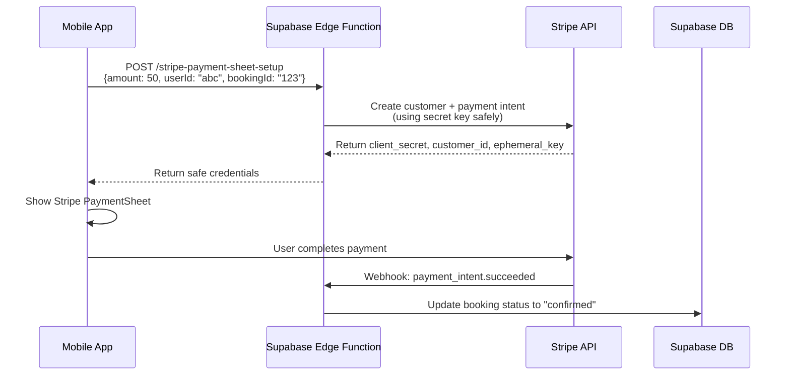

# Why We Use Supabase Edge Functions for Stripe

## 🤔 Your Question: "Why not use Stripe directly?"

**Great question!** Here's why we need Supabase Edge Functions as a middleman:

## 🔐 Security Problem with Direct Stripe

**What you CAN'T do in mobile apps:**
```javascript
// ❌ NEVER DO THIS - Exposes secret key to users
const stripe = require('stripe')('sk_test_YOUR_SECRET_KEY'); // Secret key in mobile app = HUGE security risk
const paymentIntent = await stripe.paymentIntents.create({
  amount: 5000,
  currency: 'hkd'
});
```

**Why this is dangerous:**
- Mobile apps can be reverse-engineered
- Anyone can extract your Stripe secret key
- Attackers can create unlimited charges
- Your Stripe account gets compromised

## ✅ Secure Mobile Payment Flow

**What we actually do:**
```javascript
// Mobile app (safe - only uses publishable key)
const { initPaymentSheet, presentPaymentSheet } = useStripe();

// 1. Mobile asks server to create payment
const session = await fetch('YOUR_SERVER/create-payment', {
  method: 'POST',
  body: JSON.stringify({ amount: 50, bookingId: 'abc123' })
});

// 2. Mobile uses the response to show payment sheet
await initPaymentSheet({
  paymentIntentClientSecret: session.paymentIntent, // Safe to use
  customerId: session.customer,
  customerEphemeralKeySecret: session.ephemeralKey
});

// 3. User pays through Stripe's secure UI
await presentPaymentSheet();
```

## 🏗️ Why Supabase Edge Functions?

**Option 1: Your own server**
- Need to deploy and maintain a separate backend
- Need to handle scaling, security, monitoring
- More complex infrastructure

**Option 2: Supabase Edge Functions (what we chose)**
- ✅ Serverless - no server to maintain
- ✅ Automatically scales
- ✅ Built-in security
- ✅ Same infrastructure as your database
- ✅ Easy deployment

## 📱 Complete Flow Explained



## 🔑 Where to Set Stripe API Key in Supabase

**Step-by-step:**

1. **Go to Supabase Dashboard**
   - Visit: https://supabase.com/dashboard/project/upnqezwtiehbvyurguja

2. **Navigate to Edge Functions Settings**
   - Click "Settings" in left sidebar
   - Click "Edge Functions"
   - OR direct link: https://supabase.com/dashboard/project/upnqezwtiehbvyurguja/settings/functions

3. **Add Environment Variables**
   - Click "Add new secret"
   - Name: `STRIPE_API_KEY`
   - Value: `sk_test_XXXXXXXXXXXXXXXXXXXXXXXXXXXX` (set this in Supabase, do not commit real keys)
   - Click "Add secret"

4. **Add Webhook Secret (after creating Stripe webhook)**
   - Name: `STRIPE_WEBHOOK_SECRET`
   - Value: `whsec_...` (get from Stripe Dashboard)

## 🎯 Alternative: Direct Stripe (Not Recommended)

**If you really want to avoid Supabase Edge Functions:**

```javascript
// You'd need to build your own backend server
// Express.js example:
app.post('/create-payment-intent', async (req, res) => {
  const { amount, bookingId, userId } = req.body;
  
  const paymentIntent = await stripe.paymentIntents.create({
    amount: amount * 100,
    currency: 'hkd',
    metadata: { bookingId, userId }
  });
  
  res.send({
    clientSecret: paymentIntent.client_secret
  });
});
```

**But then you need:**
- Deploy this server somewhere (Heroku, AWS, etc.)
- Handle scaling and monitoring
- Set up SSL certificates
- Manage server updates and security

## 💡 Recommendation

**Stick with Supabase Edge Functions because:**
- ✅ More secure than any DIY solution
- ✅ No server maintenance
- ✅ Automatically scales
- ✅ Same ecosystem as your database
- ✅ Industry standard approach

**Every major mobile app with payments uses this pattern:**
- Uber, Airbnb, DoorDash all use server-side payment creation
- Mobile apps never handle secret keys directly
- It's the only secure way to handle payments

## 🚀 Next Steps

1. Set the Stripe API key in Supabase Dashboard (link above)
2. Test the payment flow in the mobile app
3. Create Stripe webhook for booking confirmation

The Edge Functions are already deployed and working - you just need to add the API key!
